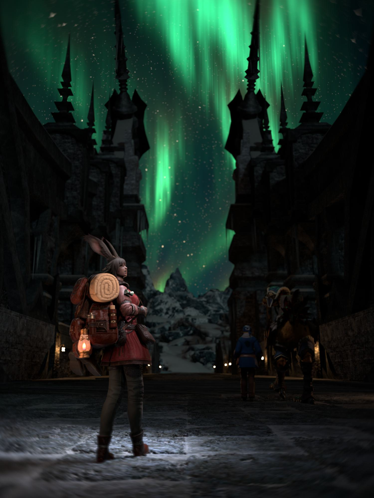
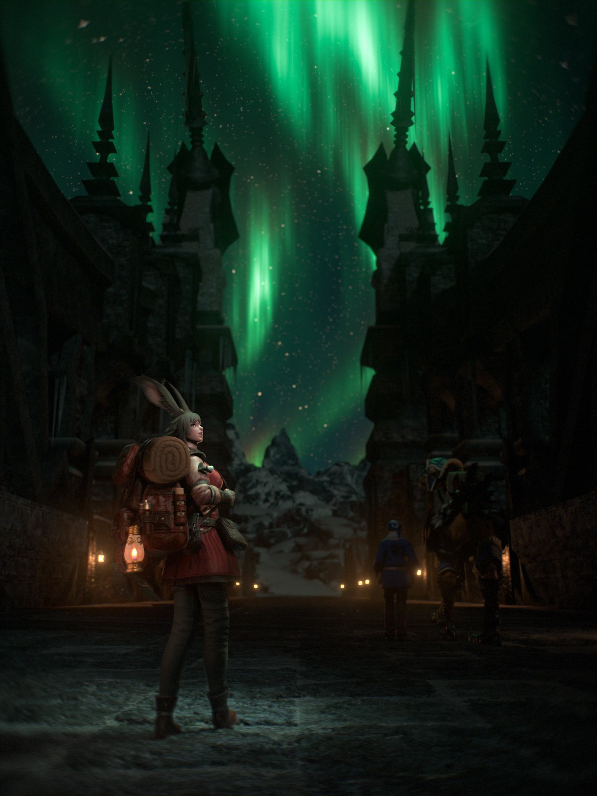
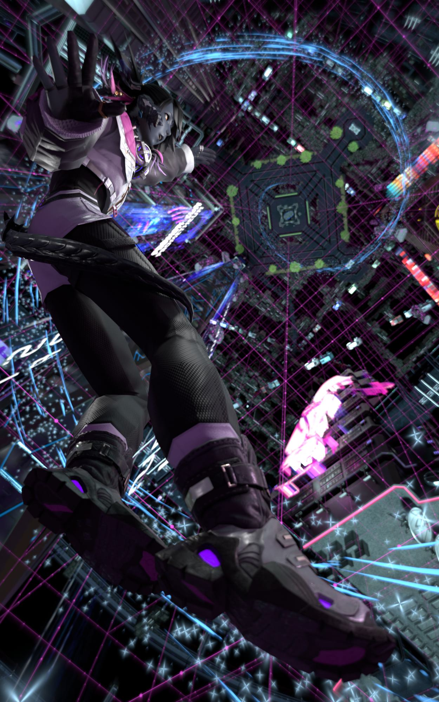

# What is Compositing?
Compositing is, in the most layman of terms, Advanced Photoshop.
{: .fs-6 .fw-300 }

We use it to enhace our renders in various ways, usually mostly procedurally using nodes. So in that sense it's not like Photoshop at all, actually.  
Usually these enhancements are to emulate the behavior of real cameras with things like Bloom, Film Grain, Chromatic Aberration, Lens Dirt, but it can really be anything.  

Here's an example of what you can accomplish with compositing:

    
    

And for a more drastic example:

    
    

 
As you can probably tell it's pretty powerful, but is it difficult?  
Like every digital art it takes some learning before you get good at it, but it's really not bad. Especially not when it comes to the effects I mentioned for emulating a real camera. Just a few simple node setups can make a massive difference in that department.

## How do?
Compositing can be done in a lot of software. If you're working with still images, even something like Photoshop is *technically* compositing but you have way better options.
* **Blender**  
You've probably noticed that among all the tabs at the top of Blender is one called "Compositing". Blender does have a decently powerful compositor, and it's getting better with each update.
* **Nuke (Non-commercial)**  
Nuke is the big-boy compositor (any my personal favorite) used on almost every single medium-to-high budget movie with any amount of VFX in it. And for good reason, it's incredibly powerful and flexible. It is also extremely expensive however *unless* you're using Nuke Non-commercial, which is free! It does come with some limitations, most notably an export resolution limit of 1920x1080p, but that's got workarounds so don't worry.[^dont-pirate-it] It's still incredible.
* **DaVinci Resolve Fusion**  
Fusion is Blackmagic's response to Nuke, built into the popular video editing software DaVinci Resolve. Compared to Nuke it has a more modern interface but personally I find it much less intuitive and harder to keep my nodes from getting cluttered. It has roughly the same features as Nuke, and the free version has fewer limitations.
* **After Effects**  
Of all the options, I recommend After Effects the least. But, it's an option, so it goes on the list. Unlike all the other options on the list, After Effects is layer-based rather than node-based. This does make it easier for beginners to grasp, but ask anyone who's learned both layers and nodes which they prefer and almost every single one of them will say nodes. It's also made by Adobe (which is never a good thing, and means it's not free[^just-pirate-it]) and it eats more RAM that it has any right to. You can definitely make cool compositing things in After Effects, but if this is the tool you choose to learn you are severely limiting your options.

[^dont-pirate-it]:
    So you might be thinking "Ok I'll just pirate it then, that's a workaround!" Do not do that. The Foundry (who make Nuke) is like the only company in existence to actually go after people who pirate their software, and there is a very real possibility that they find out and force you to pay for a full licence. Just use the free version, or if you get really into compositing like I have and use Nuke almost daily, there's an Indie version for ~€500 a year.

[^just-pirate-it]:
    This one you can just pirate lmao. Fuck Adobe. It is always morally correct to pirate Adobe software.