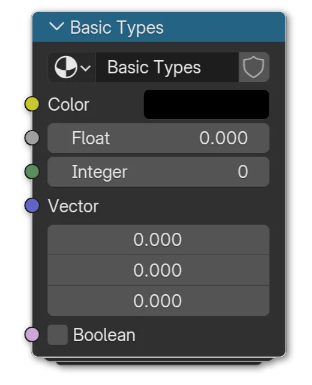

# What are Types?
Types help computers know what type of data something is.
{: .fs-6 .fw-300 }

Types (or Typing) is a common concept in programming and more advanced parts of Blender like Geometry Nodes. Blender will often auto-convert between types where it needs to but it can be good to know what it's actually doing.

Common types in Blender:

<ul>
<li><b>Color</b> Color data in Blender is represented by yellow node sockets. They're usually three or four float values (Red, Green, Blue and sometimes Alpha).</li>
<li><b>Float</b> A float is a number with decimals, like <i>1.0</i>, <i>24.95</i>, <i>-0.001</i>, etc. Blender represents them with gray node sockets.</li>
<li><b>Integer</b> Integers are numbers WITHOUT decimals, whole numbers. <i>1</i>, <i>25</i>, <i>0</i> and <i>-27191429752</i> are all integers. Blender represents them with dark-green node sockets.</li>
<li><b>Vector</b> Vectors are a list of (typically) floats. Often three of them are used to represent something three-dimensional, since we're working in 3D, but they can consist of any number of floats. They're purple sockets.</li>
<li><b>Boolean</b> Boolean values are the simplest, either True (1) or False (0). It's a checkbox. They're pink sockets in Blender.</li>
</ul>

Blender will automatically convert between these as best in can. For example if you plug a Color output into a Float input, the three RGB values become desaturated so that they're all the same, and then that is your Float value. Plug a Float value into a Boolean socket and the output will be True (1) if the float is greater than 0. Color and Vector are essentially the same thing already, just reskinned for convenience. They're both just a list of floats usually, so transfering between the two does nothing.