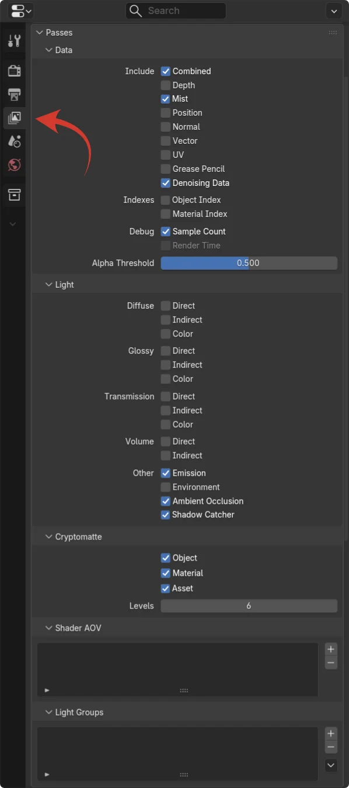
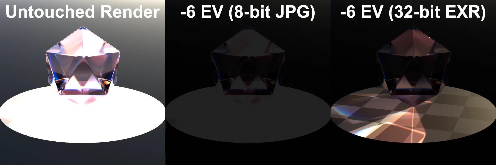

# Compositing Fundamentals
{: .fs-9 .no_toc }
This tutorial will cover the fundamentals of compositing, regardless of the program you use.
{: .fs-6 .fw-300 }

- TOC
{:toc} 

---

## Before Starting
This tutorial assumes that you've read the [Glossary page on Compositing](../glossary/what_is_compositing) so that you have a basic understanding of what Compositing actually is.

It also assumes that you are familiar with working with Nodes. If not, read the [Glossary page on Nodes](../glossary/what_are_nodes)

For the sake of simplicity I will be using Blender's compositor in this Fundamentals guide, since that's the one most people will be familiar with the layout of, but the theory will be applicable to all node-based compositing software.

This will not teach you how to make a specific effect or something like that, rather it will cover a bunch of concepts that are important to know when compositing your renders.

{: .warning }
The information in some of these sections can be very dense. If you find yourself not understanding something, don't worry. Take your time when reading and try to just go sentence by sentence. Look stuff up if you need to, or just move on and try to learn by doing later on. You can always come back to this.

## Render Passes

{: .highlight }
Render Passes are more commonly known as AOVs in the VFX industry, and Blender sometimes refers to them as such. AOV stands for Arbitrary Output Variable.

While we can absolutely do compositing on just a .jpg that we get out of Blender, it's important to note that Blender does not <i>only</i> spit out an image. We get a lot more data than that for every single pixel, as long as we've enabled Render Passes.  
Here we can enable a bunch of things, most of which are extremely useful. They're separated into a few sections:

<ul>
<li><b>Data</b> Things like the Depth pass (how far is a pixel from the camera), the Position pass (where in 3D space is the pixel) and the UV pass (what are the UVs of the mesh at the pixel) can be found here. These don't directly affect the look of the images but we can use them to drive other effects when compositing such as Depth of Field or Fog.</li>
<li><b>Light</b> These are the middle-points of how Blender calculates the scene's light. For example if you multiply Diffuse Direct with Diffuse Color, the result will be what the scene would look like with only Direct (no light bounces) Diffuse (rough, non-specular) lighting. We can use all this to for example change how shiny something appears, or changing the underlying color of an object but keeping the color of the light shining onto it the same. Of particular use is the Emission pass which only shows the things you gave an Emission shader. This makes it perfect for adding a glow to particles and things like that.</li>
<li><b>Cryptomatte</b> First off, Cryptomattes to not have anything to do with cryptocurrency, so don't worry about that. They are <b><i>extremely</i></b> useful tools for automatically getting a perfect mask of an object, by just letting you sample for example your character's hair and then having a mask you can use to edit only the hair. You can do this per object, material, and asset (which is objects that are parented to each other, and is entirely optional if you have object cryptomattes enabled, they're just a convenience)</li>
<li><b>Shader AOV</b> You can add a node called AOV Output to materials and plug whatever you want into either a color or <a href="../glossary/what_are_types">float</a> output. For example if you want to plug a material's metallic map into the output and be able to view that when compositing, you can!</li>
<li><b>Light Groups</b> These are incredibly useful. Any object (including lights) can be given a Light Group, which can then be added here. When compositing you then see the scene as if it was only lit by the things in that light group. You can for example add every light to a different Light Group, and be able to control the strength and color of each light after you've already rendered the scene.</li>
</ul>

## EXR Files and 32-bit Images
Another thing Blender gives us that a regular .jpg doesn't is 32-bit image data. Normally if a pixel is brigher than 255 (which is the highest you can count with 8 bits, which is what most image files use and what your monitor can display) then it just clips to 255, anything beyond that is discarded. What we get out of blender can go mugh higher though. This means we have a lot more details in highlights and colors than the eye can see, but we can bring that out when compositing.    

This example shows how a render exported as a JPG does not retain any information in the bright parts of the image when darkened. But if exported as an EXR file we can count to 2.14 billion as opposed to just 255, and all the brightness information stays!

Does this mean that you should start exporting your final renders as EXR files? No, we still want the final image to be 8-bit like a .jpg since that's what our monitors can display, but we want to *work* in 32-bit. If you're planning on working directly in Blender then you don't technically need to export it as an EXR ever, since data there will already be 32-bit. But it can still be nice to save your render so you can close and re-open Blender without needing to re-render.

There's another very important benefit to EXR files over the usual formats: They can store multiple images (or layers) in one file.  
This means that you can pack your entire render, render passes included, into one file per frame. When imported you can then extract each layer again.

If you just did this though the file size would be enormous, up in the gigabytes. For that reason it's also good to know that we can compress some data while still keeping it high-quailty.  
An EXR file can be compressed in many ways but the most important ones are DWAA and ZIP (yes, just like zip files). ZIP is lossless, meaning no data is lost at all. This creates big file sizes. DWAA is lossy but mostly perceptually lossless, meaning it throws away some data our eyes can't really percieve anyways. This can greatly reduce file sizes.  
When exporting it's a good idea to export most of your render passes as DWAA using something like 85% quality and set to `Float (Half)`, and only save data passes like Cryptomattes as ZIP in `Float (Full)`.

In Blender you can choose what gets exported where by setting up File Output nodes in the Compositor window. When the compositor runs, those files are saved.

## Cryptomattes

  <video controls autoplay loop style="display:block; width:100%; height:auto;">
    <source src="./assets/compfund_cryptomatte.webm" type="video/webm">
  </video>

Cryptomattes allow you to select a part of your render and get a mask of it. It works on individual objects, materials, or assets (groupings of parented objects). Cryptomattes HAVE to be losslessly compressed in order to work once exported to an EXR file.

They can't mask everything perfectly especially if it's an object in fog or similar. If you can see the object but are unable to sample it with the eyedropper tool, you can still enter the name of the object/material manually.

## Merging
A / B

## Alpha
Premult vs. Straight

## Math
You can and should use it.  
Numbers are in a 0-1 range.  
Mask by selecting pixels with a value greater than .5?

## Color Spaces & Tone-mapping
Working Color-space is what your math happens in